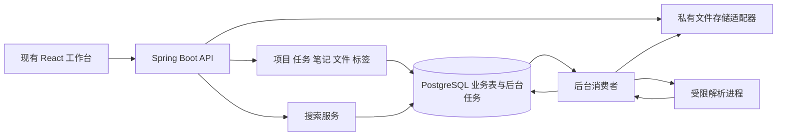
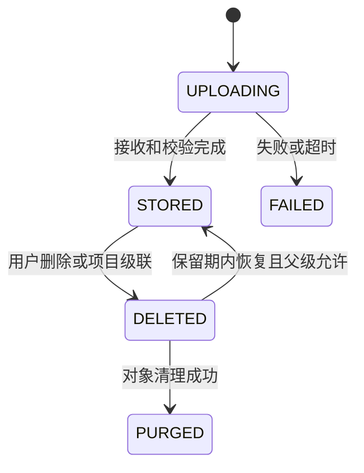

# V0.2 技术架构与关键决策

更新日期：2026-09-18  
状态：二期设计，不表示相关模块已经实现

[二期总览](../product/v0.2-plan.md) · [需求规则](../product/v0.2-requirements.md) · [数据与接口](v0.2-data-api.md) · [S3 二次封装](v0.2-s3-storage.md) · [工程约定](repository-layout.md)

## 1 架构目标

在现有 Java 25、Spring Boot、jOOQ、PostgreSQL 16、Redis 和 React 工程内增加文件、标签、搜索能力。业务数据库仍是事实来源，原始字节统一保存到用户已运行的 RustFS，通过 AWS SDK for Java 2.x 和项目 ObjectStorage 接口访问。搜索投影和提取文本可以重建。二期不拆分微服务，不改变一期默认 Workspace 与认证模型。

解析进程可以独立部署，但不承担用户认证或业务规则。后台任务初期由同一后端制品的 worker 配置运行；单机开发允许同进程调度领取任务，解析仍隔离。Redis 保留现有会话用途，不承担唯一的任务或文件元数据存储。

## 2 模块与职责

| 位置 | 主要职责 |
| --- | --- |
| 后端 `file` | 文件元数据、上传会话、容量、附件关联、回收站和提取任务编排 |
| 后端 `tag` | 标签、统一命名规则、四类对象标签集合与版本 |
| 后端 `search` | 查询规范化、检索投影、排名、摘要、授权过滤和重建 |
| 后端 `infrastructure/storage` | S3 API 二次封装和 RustFS 适配，不包含业务授权；临时落盘仅用于上传校验和重试 |
| 后端 `infrastructure/jobs` | 数据库任务领取、租约、重试和状态指标 |
| 前端 `features/file` | 列表、详情、上传队列和文件回收站 |
| 前端 `features/tag` | 标签选择器与管理页 |
| 前端 `features/search` | 全局查询、筛选、结果、来源导航 |
| 现有 Project/Task/Note | 添加文件入口与标签展示，发布自身变更事件 |

应用服务在同一事务中修改业务数据并记录任务。跨模块调用通过用例或窄接口，不从 Controller 直接操作其他模块数据库。文件存储接口不接受任意路径或外部 URL，只接受系统生成的对象键和流。

## 3 文件上传与存储

### 3.1 采用后端流式接收

首版最大 20MiB，使用“创建上传会话 → 接收字节 → 发布文件”的两阶段交互。原始文件名仅作展示和下载名称；存储键由 Workspace ID、文件 ID 和随机尝试 ID 组成。用户输入不参与目录拼接。

1. 校验登录态、当前 Workspace、格式、声明大小、项目可写性和幂等键。
2. 在短事务内锁定容量记录，检查 `used_bytes + reserved_bytes + size <= quota_bytes`，建立上传会话和 UPLOADING 文件，预占容量。
3. 流式写入服务端受限临时文件并计算 SHA-256。网关、应用和临时目录均限制字节数，不把整文件加载到 API 进程内存。
4. 完成类型校验和实际字节数核对；不符即失败，保留可定位错误并释放预占。
5. 使用可重读临时文件，将字节 PUT 到 RustFS 中该尝试独有的候选 key；完成 HEAD 和完整性核对后，进入事务重新核对上传租约、项目可写性和文件状态，保存对象引用，将预占转为已用，标记 STORED，发布提取和索引任务。该步骤是数据库发布，不依赖 S3 原子重命名。
6. 返回文件元数据。创建附件关系是后续独立幂等操作，失败不回滚已经成功的文件。

候选对象写成功但数据库提交失败时，不能把对象直接提供给用户；每次尝试单独记录候选 key、租约和补偿状态，由对账任务核对超时且无引用对象后清理。对象存储与数据库没有跨系统事务，本方案通过状态、独立尝试键和补偿处理保证恢复能力。

同一会话并发接收需租约保护。连接断开后可重新传完整文件，二期不承诺断点续传。已完成会话重试只返回已有文件，不能重写原内容。

### 3.2 存储和内容访问

开发及后续部署统一使用 RustFS，按环境区分专用私有桶。用户已运行的实例作为开发接入基线，不重复部署。webroot 之外的临时目录只承担可重读上传缓冲，不能作为故障后的永久存储回退。对象键、bucket、内部路径均不作为公开 API 字段。对象布局、校验策略、错误模型和 SDK 生命周期以 [S3 封装方案](v0.2-s3-storage.md)为准。

内容由后端读取代理，每次请求校验成员关系、文件状态和父项目可见性。前端通过现有带 Authorization 的请求客户端获取内容，再创建短期 Blob URL；关闭预览时释放 URL。避免把 Access Token 放入 URL，也不假设 iframe 会自动携带内存中的 Bearer Token。

P0 不提供公开 URL、预签名下载、Office 在线编辑或 Range 流式大文件预览。图片安全解码、文本转义、浏览器 PDF 沙箱和 `nosniff` 等响应策略由具体实现和验收确定；不直接渲染未经处理的 HTML/SVG。

## 4 文本处理与任务恢复

### 4.1 状态分离

文本处理另有 `NOT_STARTED → QUEUED → PROCESSING → READY / EMPTY / FAILED / SKIPPED`。DELETED 是文件可见性事实；它不因解析回调而改变。恢复时若原提取结果仍有效可复用，否则按当前处理代次重新排队。

### 4.2 解析隔离

建议通过 `TextExtractor` 接口接入 Apache Tika，TXT/MD 同样遵守输出和资源限制。解析仅接收服务端提供的字节；禁用任意远程 URL、嵌入资源递归、外部命令和用户提交的解析配置。工作目录临时化，不挂载宿主机凭据和项目源码。

解析进程设置网络限制、CPU/内存/时间/展开体积上限。超时杀死受限子进程，主应用记录失败。Java 堆限制不能代替进程隔离，也不能仅靠输出截断防止计算耗尽。依据见[调研文档](../product/v0.2-research.md#4-文件处理路线)。

每次任务携带 fileId、Workspace ID、contentVersion 和 extractionGeneration；正文结果发布前，在事务中锁定并核对当前文件仍为 STORED、版本及代次一致。旧结果直接丢弃，不能覆盖更新代次或删除状态。

### 4.3 任务投递与租约

新增持久化 `background_jobs` 表，业务事务直接写入待处理行，发挥事务 outbox 的作用。采用至少一次处理：

- 消费者以 `FOR UPDATE SKIP LOCKED` 领取就绪任务，在短事务内写入租约和尝试次数，提交后执行耗时操作。
- 默认租约 90 秒，处理期间每 20 秒续租；超时任务由其他消费者重领。所有结果写回需校验 leaseToken，避免失去租约的旧 worker 发布结果。
- 提取任务最多 3 次，重试延迟建议 10 秒、60 秒；索引与清理任务最多 5 次，之后进入待人工重放状态。
- 幂等键包含任务种类、Workspace、对象、版本或代次，数据库唯一约束防止重复排队。
- 事件仅记录 ID、版本和类型，不复制正文或存储凭据。错误消息面向用户时转为有限错误分类。

## 5 关键词检索设计

### 5.1 统一投影

`search_documents` 每个业务对象一行，保存 Workspace、对象类型/ID、标题、可见正文、源版本、来源更新时间和索引时间。File 的正文来自最近有效提取结果，名称在文件 STORED 后即可投影；图片也有仅名称的投影。

标签和归档权限按业务表实时读取，避免改标签名称或归档项目时依赖全量重新索引才能生效。搜索表不是授权来源。每类对象构造同结构的授权候选集合，再 `UNION ALL` 统一排名；结果和 total 必须在分页前完成相同过滤。

### 5.2 查询与中文短词

初始建议使用确定性字面检索：

1. 对标题、正文和查询应用相同 NFKC、大小写规范化及空白规则，保留原始正文用于展示。
2. 为标题和正文分别提取相邻两个 Unicode 字符组成的去重数组，合并为 `search_bigrams`，不生成跨字段边界的字符组。数组建立 GIN 索引。
3. 对每个长度至少为 2 的查询项生成字符组，以数组包含筛出候选，再在规范化标题或正文中执行完整子串复核。字符组共现不代表原词存在，禁止省略复核。
4. 多项查询取 AND，每项可命中任一字段。候选必须完整参与授权、复核、排名与计数，不能先随意截取 100 条再过滤。
5. 一字查询返回校验说明；不以无提示的全索引扫描作为兜底。特殊字符通过绑定参数和字面比较处理。

该方案避免首次交付就选择中文词典和依赖扩展的分词器，但仍有索引体积、常见词候选过多和写放大的代价。第一周必须以中文两字、英文两字、混合词和高频词验证。`pg_trgm` 可作为长度较长查询的可选优化，不能改变检索语义；新增数据库扩展要同时验证 Flyway 与当前 jOOQ DDL 生成链路。

首版每对象可搜索正文上限 200000 字符。File 超限保留截断标识；Note 当前输入上限相同，不缩减一期正文存储能力。以 5 万对象、平均正文 4000 字符作为性能参考集，索引大小和构建时间必须一起记录。

### 5.3 排名与摘要

相关性使用可解释的规则：完整标题匹配 100 分、每项标题前缀 80 分、标题包含 60 分、正文包含 20 分；每项取最高档位后求和，完整查询等于标题时再加完整标题分。按总分倒序、源更新时间倒序、对象类型及 ID 升序稳定排序。空关键词筛选按更新时间排序。

摘要取命中位置附近，最多 240 字符。规范化字符串与原始显示文本需要偏移映射，或在原始文本上进行等价匹配后产生安全的 `{text, matched}` 片段。若映射失败，返回无高亮的安全摘要，不标错位置或注入 HTML。

### 5.4 索引一致性和重建

项目、任务、笔记、文件的创建、编辑、删除都在原事务内记录索引任务；批量级联操作也必须覆盖。Worker 处理时读取最新业务状态，不使用事件中的旧正文直接覆盖投影。

投影写入采用按对象串行的数据库锁或源行锁，事务内核对当前源版本和生命周期；低版本不得覆盖高版本。文件正文还需比对 extractionGeneration。删除可记录 tombstone，查询仍必须实时过滤业务软删除状态。

重建按 Workspace 和对象游标分批执行，复用同一投影器。支持新 indexGeneration 回填、校验数量与抽样结果、追平期间增量后切换读取；保留旧代次用于快速回退。重建完成之前不能让半成品代次接管查询。

## 6 数据隔离与生命周期联动

所有业务查询从 `CurrentWorkspaceResolver` 获取范围。对象/标签/附件查询同时校验 `id + workspace_id`。新增关联使用复合外键约束同 Workspace；项目相同、未归档等动态规则在服务层事务中校验。

项目归档：实时授权过滤即可使默认搜索隐藏其子对象；读取详情仍可用，写入服务在事务内重新判断。项目删除：与一期任务/笔记软删除同事务扩展到文件及索引任务，后台负责物理对象清理。不得先删除项目再异步决定文件是否可见。

任务/笔记改项目、附件挂载和文件改项目使用一致的锁顺序：项目 → 业务对象 → 文件 → 关联行，避免并发绕过范围检查。若涉及多行，同类按 ID 排序加锁。

标签删除允许清除归档对象的分类关联，但所有对象正文保持不变。文件回收站保留容量占用，只有实际清理对象成功才减少 used_bytes；失败持续可观测并重试。

## 7 部署与演进决策

| 决策 | 二期默认 | 重新评估条件 |
| --- | --- | --- |
| 系统结构 | 模块化单体 | 出现真实独立扩缩容或团队边界 |
| 文件传输 | 后端代理、20MiB | 带宽和大文件需求成为实测瓶颈 |
| 存储 | RustFS 私有桶与 ObjectStorage 封装，开发实例已运行 | 镜像/SDK 升级或更换环境时重跑兼容验收 |
| 文本提取 | 受限进程、有限格式 | OCR 和更多格式有明确需求 |
| 后台任务 | PostgreSQL 持久化队列 | 任务量和调度需求超出当前实现 |
| 检索 | PostgreSQL 投影及 GIN | 容量或相关性目标持续不达标 |
| AI | 稳定来源 ID 与版本预留 | 按 V0.3/V0.4 单独立项 |

二期复用已运行的 RustFS，新增受限解析运行环境。健康检查需区分 API、数据库、存储与 worker，避免存储或解析故障导致整个工作台被判不可用。RustFS 端点、桶和凭据配置见[接入文档](../development/v0.2-rustfs-integration.md)；开关、迁移、发布顺序和恢复演练见[质量与发布计划](../development/v0.2-quality-release.md)。
