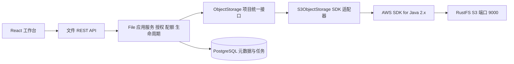

# V0.2 RustFS 与 S3 API 二次封装方案

更新日期：2026-09-18  
状态：设计规格，尚未实现封装或执行 RustFS 联调

[二期总览](../product/v0.2-plan.md) · [RustFS 接入配置](../development/v0.2-rustfs-integration.md) · [兼容与验收](../development/v0.2-s3-acceptance.md) · [文件业务 API](v0.2-data-api.md)

## 1 目标与既有条件

用户已运行 `rustfs/rustfs:latest` 容器，S3 API 映射到宿主机 9000，控制台映射到 9001，数据目录为 `E:/docker-data/rustfs:/data`。这些是用户提供的环境事实；镜像摘要、实际版本、桶和凭据权限仍待后续联调登记。

二期统一接入现有 RustFS，取消“开发默认使用本地永久文件目录、生产再选存储”的方案。应用使用 AWS SDK for Java 2.x 实现一套可复用的 S3 存储接口，再由 File 业务提供已鉴权的 REST API。封装留在现有后端，不新增独立存储微服务。

RustFS 官方 Java 指南采用 AWS SDK for Java v2，并指定自定义端点和 Path Style；本项目沿用这一接入方式。官方示例版本不作为项目锁定版本，实际 SDK BOM 与 RustFS 镜像摘要须成对验证。[RustFS Java SDK 指南](https://docs.rustfs.com/en/developer/sdk/java)

## 2 封装层次



| 层 | 负责 | 不承担 |
| --- | --- | --- |
| 文件 REST API | 接收 fileId/uploadId、认证、资源响应和流式下载 | 不接收客户端 bucket、objectKey、endpoint 或密钥 |
| File 应用服务 | Workspace 授权、配额、版本、软删除、附件和事务补偿 | 不直接使用 AWS 类型 |
| ObjectStorage | 写、读、对象头、物理删除、受控枚举、可用性检查的统一语义 | 不判断业务成员角色和项目归档 |
| S3ObjectStorage | SDK 配置、S3 请求、资源关闭、错误翻译、有限重试 | 不更新 files 表或业务配额 |
| RustFS | 保存和读取对象字节、执行桶/凭据策略 | 不知道哪个应用用户属于哪个 Workspace |

“二次封装 S3 API”的交付包含内部 Java 接口和外部文件 REST 契约。外部仍使用 `/api/v1/files`，避免同时出现 `/s3/upload` 和 `/files/uploads` 两套文件状态。后续其他业务可以调用 ObjectStorage；跨服务开放另立鉴权契约，不直接转发任意 S3 操作。

## 3 模块组织

建议位置以 `apps/backend/src/main/java/com/example/workspace/` 为根：

```text
infrastructure/storage/
  ObjectStorage.java
  ObjectRef.java
  PutObjectCommand.java
  StoredObject.java
  StoredObjectStream.java
  ObjectPage.java
  StorageException.java
  StorageErrorCode.java
  StorageProperties.java
  StorageHealthIndicator.java
  s3/
    S3ObjectStorage.java
    S3ClientConfiguration.java
    S3ErrorTranslator.java
file/application/
  FileUploadService.java
  FileContentService.java
  FilePurgeService.java
  FileStorageReconciliationService.java
  FileObjectKeyFactory.java
```

名称用于职责约定，可以按现有工程风格调整。AWS SDK import 仅出现在 `infrastructure/storage/s3` 与相应集成测试，Controller、DTO、领域对象不暴露 SDK 类型。配置绑定可以放在现有 infrastructure/config 入口。

## 4 P0 内部 API 契约

以下为 Java 设计草图，仅存在于本文；其中类型均需后续实现。

```java
public interface ObjectStorage {
    StoredObject put(PutObjectCommand command, Path replayableFile);
    ObjectMetadata head(ObjectRef object);
    StoredObjectStream open(ObjectRef object);
    DeleteResult delete(ObjectRef object);
    ObjectPage list(ObjectListQuery query);
    StorageProbe probe(StorageProfileId profile);
}
```

| 方法 | S3 映射 | 输入与输出语义 |
| --- | --- | --- |
| put | PutObject，必要时 HeadObject 和完整性核对 | 输入稳定对象引用、确切长度、类型、SHA-256、可重读临时文件；返回对象引用、长度、ETag、可用的服务端版本/校验信息 |
| head | HeadObject | 返回大小、类型、有限 metadata、ETag；对象不存在与权限拒绝明确区分 |
| open | GetObject | 返回实现 AutoCloseable 的元信息和输入流；不一次性转成 byte[] |
| delete | DeleteObject，再 HeadObject 确认 | 仅删除精确对象；返回 ABSENT 或 DELETED，失败不伪装成功 |
| list | ListObjectsV2 | 仅维护流程可调用；明确 profile、bucket、prefix、分页 token 与 limit，返回不透明 nextToken |
| probe | HeadBucket、GetBucketVersioning | 检查指定配置及桶可访问、版本模式满足约束；常规探针不写测试文件 |

ObjectRef 至少包含 `storageProfileId/bucket/key/versionId`，versionId 在 P0 未启用版本桶时为空。profile 由服务端配置白名单解析，bucket 由部署配置或已保存对象引用提供；禁止从前端请求任意拼装。

PutObjectCommand 包含 ObjectRef、sizeBytes、contentType、sha256Hex 和受控 metadata；metadata 仅放 file-id、workspace-id、content-version、sha256 等 ASCII 标识，不塞原始中文文件名、正文和密钥。

ObjectListQuery 的 limit 为 1 至 1000，prefix 必须位于已配置的管理范围；token 只作为 SDK 返回的不透明游标传递，不按页码自行推算。用户文件列表查询 PostgreSQL，不调用 S3 list 代替业务查询。

## 5 配置与客户端生命周期

采用一个应用级 S3Client，复用连接池，由 Spring 在应用退出时关闭；不能每个请求创建一个客户端。优先同步 S3Client，适配现有 WebMVC 与虚拟线程；虚拟线程不取消网络连接数、临时磁盘和上传并发限制。

客户端显式绑定 endpoint、region、应用专用凭据和 Path Style，不依赖开发电脑上的默认 AWS 凭据链。endpointOverride 后仍需 region 参与签名，Path Style 对当前 IP/localhost 地址最直接。[AWS 端点配置](https://docs.aws.amazon.com/sdk-for-java/latest/developer-guide/endpoint-config.html)

建议初始网络参数：连接 3 秒、获取连接 2 秒、socket 30 秒、单次尝试 45 秒、单次 SDK 调用总预算 120 秒、最多 3 次尝试（包含首次）、连接池 32。业务代理超时需覆盖接收、PUT、核对和提交预算，不能仅照搬一次 SDK 调用的 120 秒。

SDK 依赖采用 `software.amazon.awssdk:bom` 对齐 `s3` 与所选 HTTP 客户端。具体稳定版本在 P2-026 验证后锁定，不混用 AWS v1、MinIO SDK 和手写签名三套实现。已有 OpenAPI 默认 JSON 配置需对上传和下载显式声明 binary 内容类型。

## 6 对象布局与持久化

建议每环境一个专用私有桶，例如 `personal-ai-workspace-dev`、`personal-ai-workspace-test`、`personal-ai-workspace-prod`。这是拟定名称，不表示桶已创建；不自动接管或修改现有其他用途的桶。

```text
workspaces/{workspaceId}/files/{fileId}/v1/{attemptId}
integration-probes/{runId}/{objectId}
```

fileId 和 attemptId 由服务端生成，不使用原始文件名。对象没有可重命名的文件系统路径；用户改名只修改数据库。一次上传尝试的 key 固定，SDK 网络重试重用相同 key 与相同字节；新的业务上传尝试换新 attemptId，只有一个候选键能被当前上传租约提交。

files 新增或细化 `storage_profile_id/storage_bucket/object_key/storage_etag/storage_version_id`。storage_provider 固定为 `S3` 表示协议，profile 标识 `rustfs-local` 等部署实例。ETag 是对象标识信息，不能等同于 SHA-256；数据库独立保存本地计算的 sha256。

应用不可修改 RustFS 的 `E:/docker-data/rustfs` 底层数据。S3 对象存储布局由 RustFS 管理，不能把宿主目录当应用可任意读写的附件文件夹。

## 7 上传和发布流程

20MiB 上限下，采用“流式接收至受限临时文件 → 验证 → S3 PUT → 数据库发布”。临时磁盘用于可重试请求体，并非另一套永久存储后端。

1. 创建上传会话并预占 Workspace 容量，领取当前上传尝试租约。
2. 将浏览器输入流写入服务端私有临时目录，同时核对字节上限并计算 SHA-256。临时文件路径由服务端生成；目录总容量与并发另设硬限制。
3. 检查实际大小、格式和编码；验证失败不写入业务桶。
4. 使用确切长度和可重读文件，PUT 到该尝试的唯一候选 key。禁止用未知长度输入流触发整文件内存缓冲，也不直接把不可重读的浏览器流交给自动重试。
5. HEAD 核对长度，执行所选完整性策略；此时对象存在但尚未对用户发布。
6. 短事务内重新核对租约、项目可写性、文件状态和预占量，将该 key 写入 files，标记 STORED，转移容量并写入处理任务。
7. 清理本地临时文件。数据库提交失败或失去租约的对象记录为待补偿候选，绝不能覆盖已发布键。

S3 没有本期可依赖的“原子移动后再提交数据库”；上述发布是数据库状态切换，不需要 CopyObject 再 DeleteObject。候选 key、创建时间、租约和补偿状态须持久化在 `file_upload_attempts` 中，避免重试覆盖旧 attempt_key 后失去清理依据。

上传尝试独立于后台任务租约：建议租约 90 秒、每 20 秒续租，接收、PUT 和回读期间都需维持，单次 SDK 调用可能长于初始租约。失去租约立即停止发布；清理 worker 必须同时核对会话有效期、当前租约和已发布引用。客户端请求超时不等于服务端已经撤销，前端先查询 uploadId 再决定是否重传。

AWS 文档指出未知长度的同步流上传可能为了计算长度缓冲整个输入，本方案选择可重读临时文件以控制内存并支持有限重试。[AWS 流上传说明](https://docs.aws.amazon.com/sdk-for-java/latest/developer-guide/best-practices-s3-uploads.html)

## 8 完整性与兼容模式

默认使用 SDK 支持的校验机制，并在具体 RustFS 镜像上验证。SDK 的默认 checksum 行为会随版本改变；不能只验证官方示例使用的旧版 SDK 后就认为新版必然兼容。[AWS checksum 说明](https://docs.aws.amazon.com/sdk-for-java/latest/developer-guide/s3-checksums.html)

本项目定义两种显式策略：

- `SERVER_SHA256`：已证明当前 RustFS 对提供的 SHA-256 会实际校验，错误摘要被拒绝；记录服务端返回或可核对的校验信息。
- `READBACK_SHA256`：服务端相关 checksum 能力未验证或不兼容时，PUT 后重新 GET 并流式计算 SHA-256，与上传临时文件比较后才发布。默认采用此策略，代价是增加一次存储读取；首版最大 20MiB，需纳入性能测试。

HEAD 中的自定义 sha256 metadata 只是上传者写入的声明，不能替代上述校验。若需要兼容模式调整请求或响应 checksum，只允许限定在该 S3Client，附带失败证据和回归记录；不能全局关闭所有 SDK 校验或 HTTPS 证书验证。

## 9 下载删除与对账

下载先查数据库授权和 STORED 状态，再 `open` 并流式写响应。无论正常完成、异常还是客户端断开，都关闭或中止底层响应流，释放连接。响应已输出部分字节后不能改写为 JSON 错误或悄悄重新从第一个字节拼接；记录 requestId，用户重新发起下载。

用户删除只更新业务状态；保留期内不调用 S3 DeleteObject。到期 worker 对已记录的 bucket/key 执行精确删除，再 HEAD 确认可辨识的对象不存在，最后更新 PURGED 和容量。403、超时、桶不存在均不等于对象已成功清理。

P0 使用新建且从未开启版本控制、无对象锁的专用桶。版本控制开启或曾开启后挂起的桶可能保留历史对象，不能仅靠普通 DeleteObject 判断已释放空间，因此前置校验不满足时阻止开启文件写入，并重新设计版本清理后再接入。不得为符合该条件去关闭用户其他桶的版本或保留策略。

对账必须限制在指定环境桶和应用前缀。仅超过上传有效期与安全等待窗口、没有活动租约、没有任何 files 引用的候选才可清理；先产出清单，再由任务按精确对象执行。SDK list 的所有分页都要遍历，不能只处理第一页。

## 10 错误模型与重试

| 存储错误 | 判断 | 是否自动重试 | 外部行为 |
| --- | --- | --- | --- |
| OBJECT_NOT_FOUND | 明确的对象不存在 | 否 | 对已授权且数据库记录存在的文件返回 FILE_CONTENT_UNAVAILABLE，并触发对账 |
| ACCESS_DENIED | S3 403、策略拒绝 | 否 | FILE_STORAGE_UNAVAILABLE；不提示用户重新登录应用 |
| AUTHENTICATION_FAILED | 错误 access key、签名或时间偏差 | 否 | 配置问题，记录内部原因，外部返回存储不可用 |
| BUCKET_NOT_FOUND | 明确 NoSuchBucket | 否 | 停止文件写入，禁止自动建桶掩盖配置错误 |
| TRANSIENT_FAILURE | 限流、部分 5xx、可重试网络故障 | 有限 | 未知写入结果先 HEAD/核对，再决策；不得无限重传 |
| INTEGRITY_MISMATCH | 长度或摘要不一致 | 不盲目重试 | FILE_INTEGRITY_CHECK_FAILED，候选不发布 |
| INVALID_CONFIGURATION | endpoint、region、桶版本模式不匹配 | 否 | 文件能力不可用，一期其他功能继续 |

对象 HEAD 在某些权限条件下只能返回含糊 403，应归为权限/不可用，不转为“不存在”。日志保留 S3 状态、错误类别和供应商 requestId，但不打印 Authorization、密钥、完整签名 URL 或正文。

SDK 处理单次调用的瞬时故障，业务层处理上传会话和数据库补偿，后台任务处理到期清理。各层共享明确尝试预算，禁止出现 SDK 3 次 × 应用 3 次 × 任务 5 次的隐式放大。

## 11 对外文件 API 与封装映射

| 项目 REST API | 应用服务动作 | S3 封装 |
| --- | --- | --- |
| POST `/api/v1/files/uploads` | 鉴权、建会话、预占 | 不写对象 |
| PUT `/api/v1/files/uploads/{id}/content` | 接收、校验、发布 | put/head；按策略 open 回读 |
| GET `/api/v1/files/{id}/content` | 校验权限和生命周期 | open |
| GET `/api/v1/files` 和详情 | 查询业务元数据与标签 | 正常请求不 list 全桶 |
| PATCH `/api/v1/files/{id}` | 重命名、项目归属 | 不复制或重命名对象 |
| DELETE `/api/v1/files/{id}` | 软删除 | 不立即 delete |
| POST `/api/v1/files/{id}/restore` | 恢复元数据与索引 | 按需要 head，不重传原文件 |
| 文件清理及对账任务 | 精确删除、检查孤儿 | delete/head/list |

P1 才考虑 CopyObject、批量物理删除、预签名 URL、Multipart Upload 和断点续传；这些能力单独定义错误和撤销语义。P0 不向普通用户开放创建桶、删除桶、桶策略或 Access Key 管理接口。

## 12 交付清单

封装交付须包括接口及 DTO、RustFS 适配器、配置绑定、错误翻译、流资源管理、完整性策略、租约/候选补偿接入、单元和真实兼容测试、指标及 OpenAPI 二进制示例。P2-026 对应封装，P2-027 对应兼容矩阵；原上传、生命周期和发布任务继续负责业务集成。
