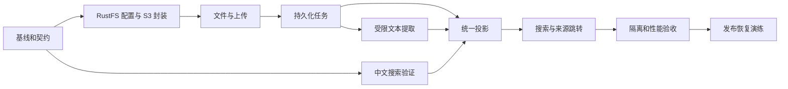

# V0.2 二期实施计划

更新日期：2026-09-18  
计划方式：相对周排期，W1 从二期实际开工周计算，不假设已经确定上线日期

[二期总览](v0.2-plan.md) · [任务清单](v0.2-backlog.md) · [发布验收](../development/v0.2-quality-release.md)

## 1 人员与容量假设

基准团队为 1 名后端、1 名前端、0.5 名测试。每周按 5 个工作日，研发有效交付率暂按 75% 计算，剩余时间留给评审、沟通、日常维护和环境等待。

新增 RustFS S3 封装和兼容验收后，任务基准为后端 33、前端 12.5、测试 8 人日，共 53.5；加 20% 风险储备后分别为 39.6、15、9.6，共 64.2 人日。推荐排期由 10 周调整为 11 周，后端和前端各约 41.25 有效人日，半职测试约 20.625 人日。后端仍是约束，不以总人日除以人数推导工期。

前端与测试空档用于契约联调、回归、文档和已排定的其他工作，不自动填入 P1。若前端具备后端能力并明确承接任务，可在 W1 后重新排程；不把未确认的跨角色替代作为承诺。

单人兼任研发和测试时，以每周 3.5 有效人日估算，64.2 ÷ 3.5 约 18.34 周，按 19 周安排。RustFS 已运行，不重新计部署；桶、应用凭据和兼容性尚需确认。兼职或一期阻塞较多时应进一步延后。

## 2 每周交付

| 周次 | 后端主线 | 前端与测试主线 | 周末可演示结果 |
| --- | --- | --- | --- |
| W1 | 001 基线、002 契约；启动 003 验证 | 核对一期路由和组件；按契约设计状态与测试样本 | 范围、接口、样本和风险可评审；003 可在 W2 初收尾 |
| W2 | 完成 003、004，启动 026 S3 封装 | 启动 008 上传和文件页；准备 027 兼容样本 | 现有 RustFS 镜像、桶和配置明确，元数据迁移可用 |
| W3 | 完成 026，推进 005 上传 | 推进 008；027 先验证协议、checksum 与权限 | 项目统一 S3 API 可用，存储兼容问题提前暴露 |
| W4 | 完成 005，推进 006、012 | 完成 008，推进 009 附件与预览 | RustFS 上传、下载和元数据链路可演示 |
| W5 | 完成 012 及 006 清理集成，推进 007 | 推进 009；验证断线、重试、回收站 | 文件引用、删除恢复和持久化任务闭环可用 |
| W6 | 完成 007、010，启动 013 投影 | 完成 009、推进 011 标签 | 正文处理与统一标签可演示 |
| W7 | 完成 013，推进 014 搜索 | 完成 011，推进 015 搜索页 | 四类索引、历史回填与搜索基础能力可验证 |
| W8 | 完成 014、017、018 | 完成 015、016，启动 020 和一期回归 | 上传 → 标签 → 正文搜索 → 来源返回闭环可用 |
| W9 | 完成 019，处理集成缺陷 | 执行 020、021、022；完成 027 协议与权限门槛 | 迁移、隔离和生命周期证据齐备 |
| W10 | 配合 023 性能并使用风险储备修复问题 | 完成 021、022、023；准备说明和演示 | 兼容及性能达标，候选版本冻结 |
| W11 | 024 数据库与 RustFS 恢复、发布演练 | 025 文档与验收；补齐 027 恢复证据 | P0 验收通过，具备灰度与回滚条件 |

表格允许任务跨周，具体日分配以人员可用性和依赖为准。每周后端应控制在约 3.75 有效人日，储备集中用于集成和故障处理；若两周滚动预测超出容量，立即调整后续日期，而不是同时承诺所有任务。

## 3 里程碑与退出条件

| 里程碑 | 计划时间 | 必须达到的结果 |
| --- | --- | --- |
| M0 方案可实施 | W2 初 | 基线确认；两字中文和解析隔离验证完成；接口和格式范围冻结 |
| M1 文件可以用 | W5 末 | RustFS 封装可用；上传、下载、容量、引用、删除恢复闭环，任务可恢复 |
| M2 内容可以找 | W8 末 | 支持格式正文、统一标签、四类全局搜索和来源跳转完成 |
| M3 具备上线条件 | W10 末 | S3 兼容门槛、安全负例、一期回归、迁移和性能通过，严重问题清零 |
| M4 二期交付 | W11 末 | 数据库与 RustFS 恢复及回滚演练完成，灰度可控，验收记录齐全 |

里程碑以结果判定，不以周次自动标记完成。文件页面上线预览不能替代 M2 的完整检索闭环。

## 4 关键依赖路径

标签迁移与文件 UI 可在明确契约后独立推进；前端可以用契约样例开发，但最终验收必须连接真实后端。迁移链路、存储配置和 worker 不可留到“前端做完再接”。

## 5 第一周要锁定的事项

| 事项 | 默认建议 | 负责角色 | 不确定时如何继续 |
| --- | --- | --- | --- |
| 团队投入 | 1 后端、1 前端、半职测试 | 项目负责人 | 先做契约和验证，按实际角色容量重排日期 |
| 运行范围 | 个人或受控私有部署 | 产品与后端 | 不新增公开分享、开放文件接收和企业权限 |
| 存储实例 | 用户已运行的 RustFS；私有桶；AWS SDK v2 封装 | 后端 | W2 登记镜像与桶配置，W3 验证兼容；不重复部署和回退本地永久存储 |
| 初始容量 | 单文件 20MiB、Workspace 1GiB | 产品与后端 | 按默认值实现可配置限制，调整值需重跑相关验证 |
| 中文检索 | 规范化字符组索引与字面复核 | 后端与测试 | 先测两字中文和高频词；失败后重新评估，不静默删需求 |
| 解析版本 | 维护中的稳定版，固定版本和资源限制 | 后端 | 不使用浮动 latest；样本未通过前不开放正文搜索 |

## 6 风险与应对

| 风险 | 触发信号 | 处理方式 | 责任角色 |
| --- | --- | --- | --- |
| 中文候选过多、索引体积大 | W1/W2 验证或 W9 压测未达标 | 检查规范化和查询计划；优化索引；必要时重新评估检索方案与日期 | 后端 |
| 恶意或特殊文件拖垮进程 | 超时、OOM、解析线程不能终止 | 限制格式与资源，修复隔离；在通过前关闭受影响格式 | 后端 |
| 项目级联漏处理附件或索引 | 删除后还能搜到或下载 | 视为发布阻塞，补事务和负例；不能靠定时清理掩盖 | 后端、测试 |
| 上传数据库与对象存储不一致 | 对象孤儿、容量长期预占 | 对账与补偿；发布前做故障注入 | 后端 |
| 任务积压或重复发布旧结果 | 索引延迟、版本倒退 | 检查租约、幂等和代次；受控重放或重建 | 后端 |
| 一期未完项被误当二期前置 | 看板、Note-Task 关联挤占排期 | 单独登记；只有阻塞核心闭环时经变更计入 | 产品 |
| 人员与估算不符 | 两周内实际消耗超过估算 25% | 更新剩余工作预测；重新排里程碑 | 项目负责人 |
| 同时改动已有 API 文档和业务代码 | 基线持续漂移或冲突 | W1 确认集成点，按最新基线增量修改 | 全体开发 |
| RustFS 与 SDK 组合不兼容 | 签名、checksum、删除或桶版本校验失败 | 固定镜像与 SDK 组合，执行 027；用有证据的回读策略，不忽略完整性错误 | 后端、测试 |

## 7 范围与进度控制

每周安排一次可运行演示和一次剩余工作复核。进度以通过验收的用户闭环衡量，同时记录剩余缺陷、后端关键路径和下周依赖。

变更记录至少包含：问题、目标用户、是否 P0、增加的人日、影响任务、替换范围、更新后的里程碑。新增 OCR、语义检索或多人协作须作为独立范围处理。

延期顺序：不启动 P1；将可独立预览的文件能力作为阶段成果；为剩余 P0 重新确定日期。权限、删除、容量正确性、任务恢复和验收证据不可作为压缩项。

## 8 二期结束时的交付清单

可用版本应包括文件和附件流程、标签、全局搜索；工程交付包括数据库迁移、存储与解析配置、可恢复 worker、索引重建方式、API 文档和关键指标；质量交付包括样本集、用例结果、性能记录、恢复演练与已知限制。

当前这组文件交付的是二期规划文档。后续实现、测试、部署和正式上线须根据本计划执行，不能将规划中的目标写成已经完成的结果。
